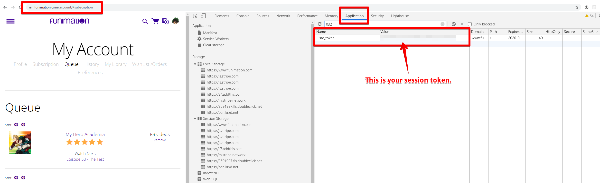

# FunimationTools
Repo of tools to create features that funimation is missing such as deleting the history of a whole show.

# Getting your session token and CSRF Token

**WARNING** Please keep in mind that your session token and CSRF token are all that is needed to make requests to funimation on your behalf. Giving these tokens to someone else is the equivalent of giving them your username and password. Please don't enter these on any sites or give them out. The scripts in this repository ONLY make requests to funimation servers directly and do not make any attempt to steal your accounts.

### Session Token
Your session token is stored as a cookie for funimation named `src_token`

You will need to paste this value into the script when it asks for it.

### XSRF Token
Your xsrf token will be returned in the body of a page from funimation while you are logged in.
First log in to funimation in your browser, then one of the following:
Right click + view-source -> ctrl+f to search -> search for `csrfmiddlewaretoken`
Open dev tools -> ctrl+f to search -> search for `csrfmiddlewaretoken`

You will also need to paste this value into the script when it asks for it.

### Delete History
delete_history.py can be used to delete all of the history of a show from your funimation account.
Funimation does not currently provide a way to mass delete history other than individually clicking delete on your history page.
